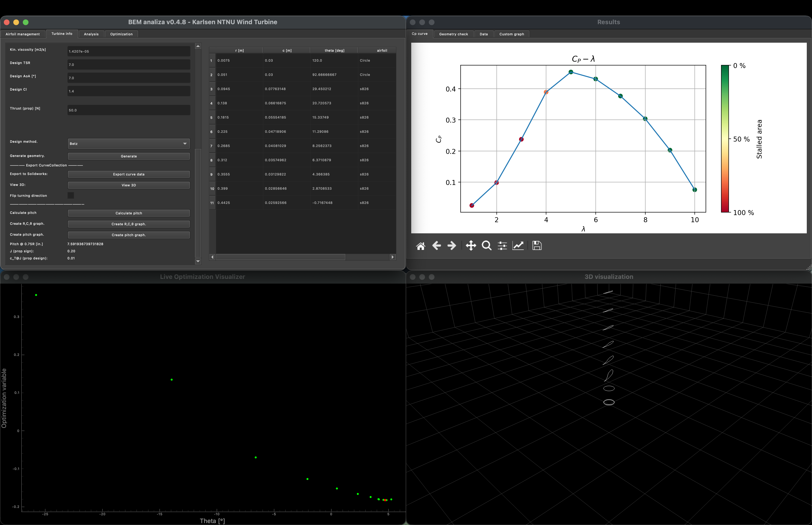

# Python BEM

## What is it for?
Wind turbines and propellers involve relatively complex geometries, and due to the rotation of the turbine, movement of the air, and the fact that lift is a function of the shape of each blade, it is hard to calculate the forces, power and efficiency of such systems by hand.

Methods for determining the parameters of such turbines were in the past mainly experimental, and nowadays relatively accurate calculations can be made using 3D computational fluid dynamics calculations. The main disadvantages to such methods are the cost, and time involved in preparation, calculation, and post-calculation analysis.

In order for a turbine designer to quickly generate a geometry and determine the forces and other parameters of a turbine, a fast, cost-effective way is to use the blade element momentum theory.

## Blade element momentum theory

Blade Element Momentum theory software (BEM) is a tool for calculating the local forces on a propeller or wind turbine using the blade element momentum theory. The calculation is based on the Rankine-Froude momentum theory and the blade element theory.

The main disadvantage of BEM is that it does not account for complex 3-D hydrodynamic and aerodynamic effects. It is still relatively accurate, and the quality of the analysis is better with larger turbines and with higher-quality input data.

In principle, the calculation is done on a single blade. Each blade is divided into sections, and forces on each section are calculated separately. The coefficients of lift and drag (cL and cD) of each section depends mainly on the Reynolds number of the medium and the angle of attack (but also depends on other factors, such as the boundary layer, etc.). An iterative system of equations is then set up to determine the needed parameters.

The input to the calculation consists of the following data: \
a. basic turbine data (tip radius, hub radius, type of turbine, type of fluid) \
b. geometry of each section (chord length, twist angle, radius, type of airfoil) \
c. the lift/drag curves of each airfoil \
d. calculation parameters (main equation selection, selection of corrections, etc.) \
e. other parameters \

The output of the calculation consists of: \
a. forces acting on each blade \
b. the total power, torque and efficiency \
c. (optionally) statical analysis \
d. other parameters \

## Similar software

Software that fulfill a similar role, and were an inspiration to the development of this software, include:
QBlade, Aerodyn, XFOIL, etc.

There are many custom BEM-based applications that turbine and propeller manufacturers develop in-house and are not publicly available.

## How to use the software

### Main window

The BEM software main window is divided into multiple tabs, which are divided by their corresponding function, these are: Airfoil management, Turbine info, Analysis and Optimization. The analysis is started on the Analyiss tab and after it is finished, an Results window is finally opened, from which results can be checked on and exported, as necessary.

### Airfoil management

In the Airfoil management tab, a designer can: \
	a. Add, rename, duplicate, remove, load and save airfoil data \
	b. import airfoil data \
	c. import or calculate the cL/cD curves of an airfoil \
	d. create 360° cL/cD curves using Montgomerie methods \

### Turbine info

In the Turbine info tab, a designer can: \
	a. Set up the basic turbine data (name, radii, number of blades, etc.) \
	b. Set the turbine scaling and interpolation, if needed for calculation for different sizes and numbers of sections \
	c. Generate a preliminary geometry of wind turbines or propellers using different methods (included are Betz, Schmitz, Larrabee, Adkins) \
	d. View the generated geometry in 3D \
	e. Export the geometry to Solidworks \
	f. Create standard geometry graphs for distribution and documentation purposes \

### Analysis

In the Analysis tab, a designer can: \
	a. Determine the basic calculation parameters \
	b. Run the analysis, which will, after finishing, open the results window \

### Optimization

In the Optimization tab, the designer can optimize the geometry using an optimization algorithm in order to ensure that the geometry is optimized to a specific fluid speed/rotational velocity combination. The parameters that will be modified are called input parameters, and the parameters that will determine the success of the optimization (optimization function) are called the output variables. Target variables are also supported, in case one desires not the largest torque, power, or other parameter, but instead a specific torque, power or other parameter.

The optimization GUI is still in developement.

# Installation and usage

### Supported Python version
3.2+

### Install
pip install -r requirements.txt

### Usage
python main.py

### Create Executable
pyinstaller main.spec

### On Mac - to run xfoil
brew install xquartz

# License

Python BEM - Blade Element Momentum Theory Software.

Copyright (C) 2022 M. Smrekar

This program is free software: you can redistribute it and/or modify
it under the terms of the GNU General Public License as published by
the Free Software Foundation, either version 3 of the License, or
(at your option) any later version.

This program is distributed in the hope that it will be useful,
but WITHOUT ANY WARRANTY; without even the implied warranty of
MERCHANTABILITY or FITNESS FOR A PARTICULAR PURPOSE.  See the
GNU General Public License for more details.

You should have received a copy of the GNU General Public License
along with this program.  If not, see <https://www.gnu.org/licenses/>.